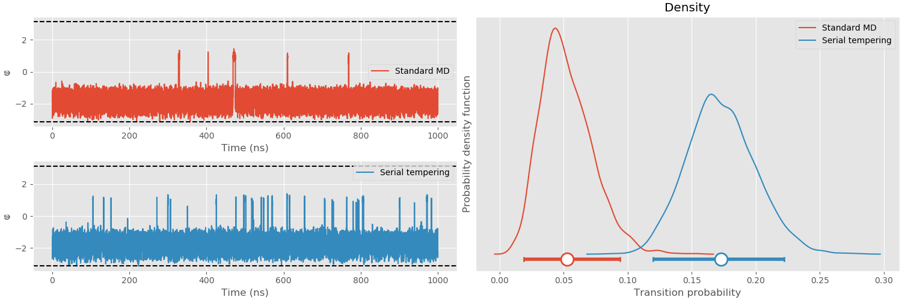

# gst
 generalized serial tempering

## alanine dipeptide
The slow degree of freedom (the φ angle) is sampled quite slowly in standard MD (red timeseries, left top panel). When serial tempering is applied, the sampling between states is faster (blue timeseries, left bottom panel). This can be quantified by fitting a Markov state model with two states and taking the probability of transitioning between states The probability of transitioning from the base state (φ at about -2 radian) into the 'excited' state (φ at about 1 radian) is just over 3 times larger when serial tempering is applied, indicating 3X faster sampling. 

