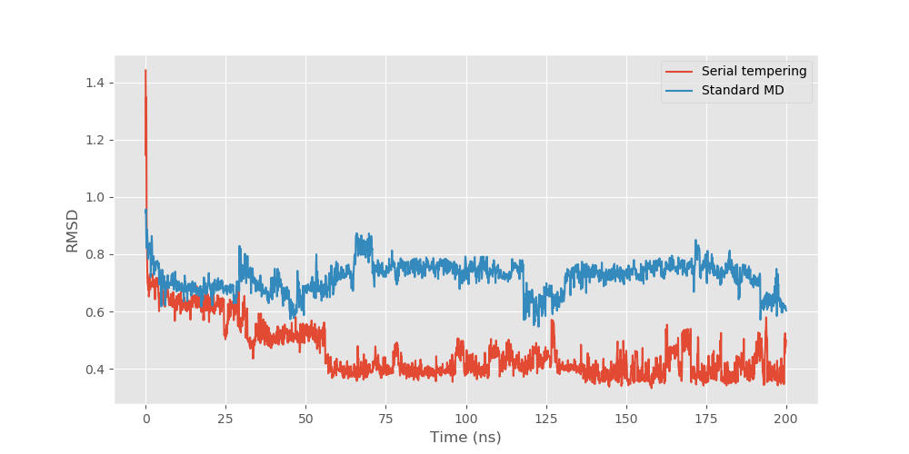

# gst
 generalized serial tempering

## alanine dipeptide
The slow degree of freedom (the φ angle) is sampled quite slowly in standard MD (red timeseries, left top panel). When serial tempering is applied, the sampling between states is faster (blue timeseries, left bottom panel). This can be quantified by fitting a Markov state model with two states and comparing the probability of transitioning between states. The probability of transitioning from the base state (φ at about -2 radian) into the 'excited' state (φ at about 1 radian) is just over 3 times larger when serial tempering is applied, indicating 3X faster sampling. 

## trp cage
This enhanced sampling translates to peptide folding - at least in the trp-cage model commonly used as a test case. Trp-cage is a short peptide with a folded state having a tryptophan residue enclosed in a 'cage'. Starting from the unfolded peptide, the figure below compares 200ns of standard MD and serial tempering. Following the root mean square deviation (RMSD), which measures difference to the true folded structure (smaller is better), can see that serial tempering finds the correct backbone  structure at about 60ns, and then there is a rotation of the tryptophan into the cage conformation at around 130ns. The standard MD simulation fails to find the correct conformation in this time. 

