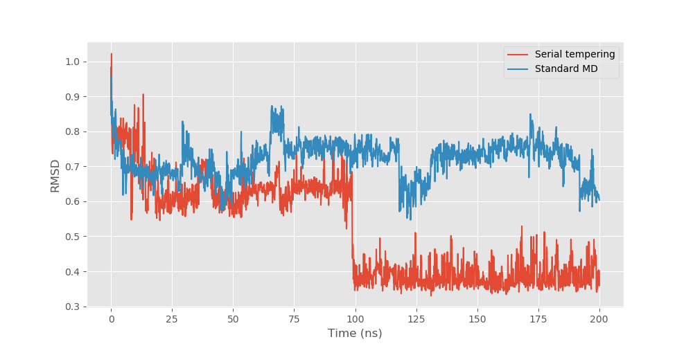

# gst
 generalized serial tempering

## alanine dipeptide
The slow degree of freedom (the φ dihedral angle) is sampled quite slowly in standard MD - observe the small number of transitions into the rare 'excited' state (red timeseries, left top panel). When serial tempering is applied, the sampling between states becomes much faster (blue timeseries, left bottom panel). 

This can be quantified by fitting a Markov state model with only two states, allowing us to compare the probability of transitioning between the states. The probability of transitioning from the base state (φ at about -2 radian) into the excited state (φ at about 1 radian) is just over 3 times larger when serial tempering is applied, indicating ~3X faster sampling. 

## trp cage
This enhanced sampling translates to peptide folding - at least in the familiar trp-cage model commonly used as a test case for enhanced sampling. Trp-cage is a short peptide with a folded state having an alpha helix and a tryptophan residue enclosed in a 'cage'. Starting from the unfolded peptide, the figure below compares 200ns of standard MD and serial tempering. Following the root mean square deviation (RMSD), which measures the difference between any given structure and the native folded structure (smaller is better), one can see that serial tempering finds the lowest RMSD, having found the correct backbone  structure at about 60ns. Observing the trajectory (not shown), there is a rotation of the tryptophan into the cage conformation, making the RMSD even smaller at around 130ns. The standard MD simulation fails to find the correct conformation in this time. 

The second figure shows the lowest RMSD structures all aligned - green is the original folded structure from NMR, blue is from standard MD (not very good alignment). and red is from serial tempering (very close alignment). 

## lateral diffusion in the membrane
??
