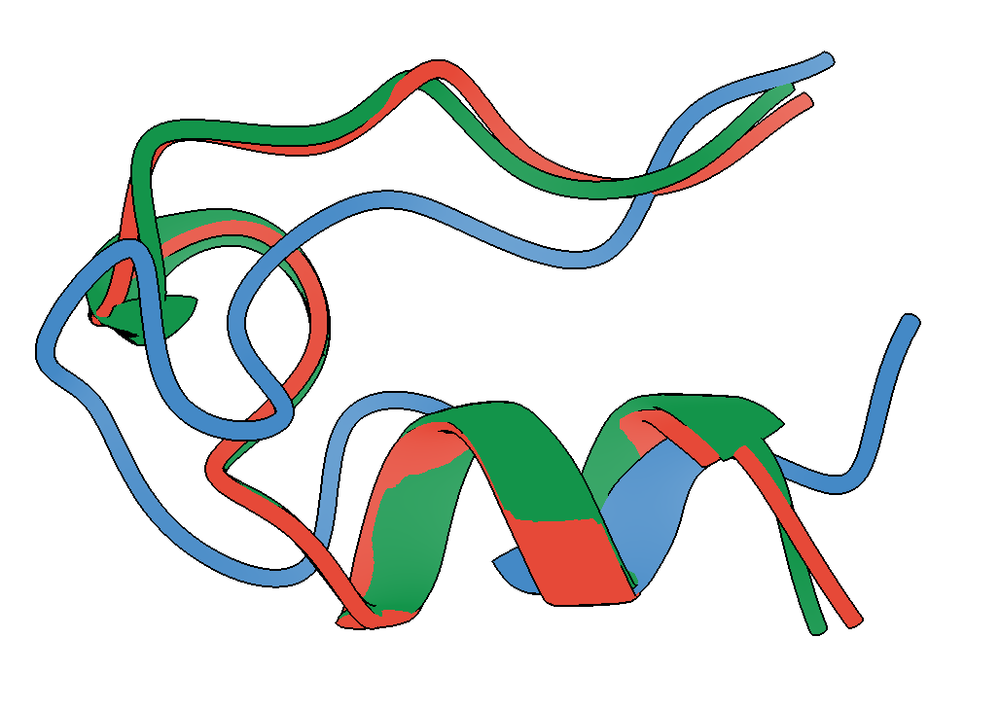

# Generalized serial solute tempering in OpenMM: identify ligand binding-sites using a single GPU

### Ali initial Kusay, Michael T. Bowen, Thomas initial Balle, Lewis J. Martin

*Lewis J. Martin ([lewis.martin@sydney.edu.au](mailto:lewis.martin@sydney.edu.au)),*

further affiliations.

## Abstract

Generalized serial solute tempering. 

## Introduction

Citations go like this: [@Martin2014a; @Corry2014]

Enhanced sampling methods speed up sampling of either a specified degree(s) of freedom, or all degrees of freedom. 

Unbinding mechanisms are uncommon because they start in a low entropy state and end in a high entropy state. Because the binding site is known, they also have a convenient definition of the CV to bias. Less common is binding simulation - even more so when the binding site is unknown, since there is no known CV to bias.

## Results

We shall have subheadings:

### Generalized serial solute tempering

Methodology explanation. 

### Alanine dipeptide

The alanine dipeptide, formally N-Acetyl-DL-alanine methylamide, is a single alanine residue with acetyl N-terminal and amide C-terminal caps. It is the work-horse of molecular dynamics methods development [@brooks1993simulations] because it is small enough to simulate long timescales while representing typical protein movements and also having a slow degree of freedom that demonstrates the effect of enhanced sampling. We sampled alanine dipeptide under SMD or GST conditions for 1000$ns$ in implicit solvent to demonstrate the effect of tempering the dihedral angle term (**Figure 1**).  

Typically, one of the backbone dihedral angles, $\varphi$ (phi), samples two states with a majority population at the ground state $\varphi\approx-2$ and a minority population at the excited state $\varphi\approx1$. Because the sampling between the two states is slow in standard MD, few transitions into the excited state are observed over this time (**Figure 1A**). In GST, where all dihedral angles are tempered, the excited state is visited far more frequently, without altering the variance of the ground state (**Figure 1B**).  The transition probability between the states, estimated by fitting a two-state Markov state model using Bayesian estimation, shows that GST increases the probability of sampling the excited state from 0.05% to 0.35% (**Figure 1C**, using the maximum *a posteriori* (MAP) estimate). Using the MAP estimate for transitioning into the excited state, **Figure 1** shows that GST samples 6.8X faster than standard MD.

### Trp-Cage

Extending the results for alanine dipeptide to a slightly larger system, we also compared standard MD and GST, again tempering the dihedrals, on the trp-cage peptide in implicit solvent. Trp-cage is a short, 20-amino acid peptide that folds on a timescale accessible by molecular dynamics (~4$\mu s$, [@qiu2002smaller]), making it amenable to demonstrating enhanced sampling techniques.  We simulated under both conditions for 200$ns$, and measured the root mean squared deviation (RMSD) to the folded state determined by NMR (PDB accession code 1L2Y, [@neidigh2002designing]). While the peptide is not expected to fold within this time using standard MD, we observed folding into the native state within 100$ns$ using GST, as indicated by a sharp drop in RMSD (**Figure 2A**). Comparing the lowest-RMSD structures from both simulations to the NMR structure, one can see that the conformation achieved in GST has close correspondence to the folded structure in both the backbone as well as the titular tryptophan residue enclosed in a cage of residues, while the conformation from standard MD has neither. 

### Lateral diffusion

### Trypsin - benzamidine

### Tetraspanin

## Discussion

## Acknowledgements

Lambert initiative. OpenMM authors and contributors. 

## Methods

latex is fine and goes like this:
$$
T_s = \mu + \frac{\alpha - \mu}{1 + e^{\gamma(\beta - T_a)}}
$$
